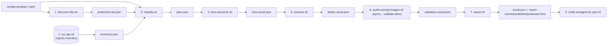
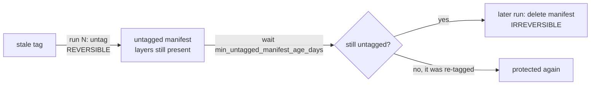
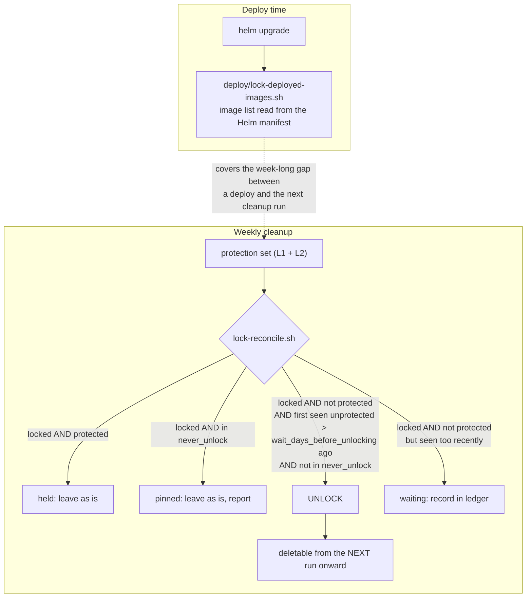

# ACR Cleanup

Config-driven, safe, parallel cleanup for Azure Container Registry, with image protection derived
from what is actually running in Kubernetes.

Built for `myregistry` (MyProduct) but intentionally product-agnostic — see [ADOPTION.md](./ADOPTION.md)
to use it for another product.

## Documents

| Read this | When you want to |
| --- | --- |
| **README.md** (this file) | understand the design: why it exists, the protection layers, what gets deleted and when |
| [USER_GUIDE.md](./USER_GUIDE.md) | run it yourself, stage by stage, and read what each stage produced; run the tests |
| [CONFIGURATION.md](./CONFIGURATION.md) | look up any option, default, range or override syntax |
| [RUNBOOK.md](./RUNBOOK.md) | recover an image, stop the cleanup, act on a symptom |
| [ADOPTION.md](./ADOPTION.md) | bring the module to another product |
| [MAINTENANCE.md](./MAINTENANCE.md) | see every external API, CLI and tool it depends on, and how to update when one breaks |
| [CONTRIBUTING.md](./CONTRIBUTING.md) | change the code: where each behaviour lives, the data contracts between stages, how tests are built |

---

## 1. Why this exists

`myregistry` baseline captured on 2026-09-03:

| Metric | Value |
| --- | --- |
| Repositories | 61 |
| Tags | 385,992 |
| Manifests | 455,492 |
| Storage | ~2.06 TiB (Premium includes 500 GB) |
| Geo-replications | 2 — `westus2` (zone-redundant) and `eastus`; storage overage billed on ~3x the footprint |
| Soft delete | **not available** — blocked by geo-replication, see [section 4](#l4--structural-floors-and-the-recovery-window) |

Several repositories hold roughly **twice as many manifests as tags** — for example
`myproduct/tsp` at 9,994 tags vs 18,956 manifests. Those are orphaned manifests that
`acr purge --untagged` has never been able to reclaim. That is where the terabytes are.

At 455k manifests, enabling Microsoft Defender for Cloud image scanning would be prohibitively
expensive, which is the cost driver behind the user story.

### What was already in place, and why it failed

| Mechanism | What it did | Why it failed |
| --- | --- | --- |
| ACR task `imagePurgeTask` | `acr purge --filter 'myproduct\/\w+.*:.*' --ago 365d --untagged` | 365d retention for every kind of tag; skips locked images silently; ignores non-`myproduct/*` repos |
| ACR task `PRpurgeTask` | Same, filtered to `PullRequest` tags | Same 365d value; PR builds are the highest-volume group |
| "Lock deployed images" release step | Locked `write`+`delete` on deployed prod images | **Nothing ever unlocked them.** Every prod deploy since inception permanently pinned a full image set. Also blocked the untagged-manifest sweep behind those digests |
| `inUse` marker tags | `az acr import` created `<tag>-<env>-inUse` to mark deployed digests | Right idea, wrong storage. Only untagged in non-prod, and additionally locked in prod, so markers accumulated forever. Also doubled tag count, and matched tags by unanchored substring (`5.5.0-beta.1-13` matches `5.5.0-beta.1-136`) |

This module replaces all four.

---

## 2. How it works



Stages run **strictly in sequence**, never in parallel with each other. Parallelism exists *inside*
stages 1, 2 and 5. Every stage reads and writes plain JSON on disk, so each one can be run on its
own and its output inspected.

### Layout

```
devops/acr-cleanup/
├── acr-cleanup.sh            # entrypoint / orchestrator
├── lib/
│   ├── common.sh             # logging (stderr), tool checks, bash version guard
│   ├── config.sh             # load + validate config, apply overrides
│   ├── discover-k8s.sh       # 1. protection set from clusters
│   ├── acr-api.sh            # 2. ACR REST: token, inventory, untag, delete, lock/unlock
│   ├── classify.sh           # 3. never_delete -> cleanup rules -> plan
│   ├── lock-reconcile.sh     # 4. the ONLY writer of lock state
│   ├── execute.sh            # 5. untag + untagged-manifest sweep
│   ├── report.sh             # 7. result.json + report-summary/deleted/protected.html
│   └── notify-sendgrid.sh    # 8. opt-in email
├── deploy/
│   └── lock-deployed-images.sh   # used by the release task group at deploy time
├── config/
│   ├── myproduct.yaml
│   └── example.yaml
├── tests/
│   ├── config.test.sh                # config load, overrides, validation
│   ├── discover-k8s.test.sh          # image reference parsing, host matching, fail-closed merge
│   ├── acr-api.test.sh               # retry, pagination, scopes, inventory shape
│   ├── classify.test.sh              # retention decisions, protection, manifest sweep
│   ├── lock-reconcile.test.sh        # ledger round-trip, unlock invariants
│   ├── execute.test.sh               # dry run, circuit breaker, pre-delete re-check
│   ├── report.test.sh                # result.json / the 3 report-*.html files, SendGrid payload
│   └── lock-deployed-images.test.sh  # environment gate, manifest extraction, lock calls
├── tools/
│   ├── snapshot-evidence.sh          # summary.md + report files from a work dir, for archiving a run
│   ├── audit-running-images.sh       # post-cleanup: is everything actually deployed still pullable?
│   │                                 #   (stage 6, opt-in via acr-cleanup.sh --validate-after)
│   └── audit-multiarch-references.sh # registry-wide: every tagged multi-arch image, deployed or not
├── README.md · USER_GUIDE.md · CONFIGURATION.md · RUNBOOK.md · ADOPTION.md
└── MAINTENANCE.md · CONTRIBUTING.md · AGENTS.md
```

All tests are pure: no Azure, no network, no cluster access.

---

## 3. Execution flow

| # | Stage | Script | Reads | Writes | Mutates ACR? | On failure |
| --- | --- | --- | --- | --- | --- | --- |
| 1 | Discover | `discover-k8s.sh` | config, clusters | `protection-set.json` | No | **Abort the run** |
| 2 | Inventory | `acr-api.sh` | registry | `inventory.json` | No | **Abort the run** |
| 3 | Classify | `classify.sh` | inventory + protection set | `plan.json` | No | **Abort the run** |
| 4 | Reconcile locks | `lock-reconcile.sh` | plan + previous run's `lock-ledger.json` | `lock-result.json`, `lock-ledger.json`, `unlock-events.jsonl` | **Yes** — unlock only | Record error, continue to report, exit non-zero |
| — | *carry forward* | orchestrator | this run's `result.json`, `lock-ledger.json` | `<previous-dir>/*` | No | Best-effort |
| 5 | Execute | `execute.sh` | plan | `delete-result.json` | **Yes** — untag + manifest delete | Record error, continue to report, exit non-zero |
| 6 | Validate (opt-in, `--validate-after`) | `tools/audit-running-images.sh` | protection-set.json (`--skip-discover`) | `validation-result.json` | No | Record error, continue to report, exit non-zero |
| 7 | Report | `report.sh` | everything above | `result.json`, `report-summary.html`, `report-deleted.html`, `report-protected.html` | No | Exit non-zero |
| 8 | Notify | `notify-sendgrid.sh` | report | — | No | Warn only |

Two properties worth stating explicitly:

- **Stages 1–3 are read-only**, so they are always safe to run ad hoc against production.
- **The report is always published, even when a stage fails.** You never lose the diagnosis.

### Why stages 4 and 5 must not overlap

`execute.sh` **never touches lock state**. `lock-reconcile.sh` is the only writer of locks, and
`execute.sh` simply **skips any locked tag** with reason `locked`.

That single-writer rule removes an entire class of race conditions, and it means deleting a
formerly-locked production image always takes two runs:

| Run | `lock-reconcile.sh` | `execute.sh` |
| --- | --- | --- |
| Week 1 | tag left the protection set longer ago than `wait_days_before_unlocking` → **unlock** | tag was locked at scan time → **skip** |
| Week 2 | already unlocked, nothing to do | age + rule say delete → **delete** |

So every unlock appears in at least one report before anything can act on it.

**An orphan does not always need the wait.** `classify.sh` computes, for every tag and untagged
manifest, whether the normal age and count rules alone — ignoring protection and the lock entirely —
already call it a candidate (`would_delete` / `would_sweep` in `plan.json`). A locked image is
almost always a real build that was genuinely deployed at some point, so by the time it goes
unprotected it is usually already well past its own retention window. `lock-reconcile.sh` unlocks
those **immediately**, on the very first run, with no ledger history required. Only a locked item
that is unprotected but still *young* (inside `always_keep_newest` or `delete_when_older_than_days`)
falls back to the ledger-tracked wait below — the wait exists for that borderline case, not as a
blanket delay on every orphan. The report's Locks section shows both counts separately, and
`lock-result.json`'s `unlock_basis` field (`already_past_retention` vs `wait_elapsed`) records which
path each unlock took.

For the borderline case, `wait_days_before_unlocking` is measured from the **first run that saw the
item locked and unprotected**. That first-seen time is kept in `lock-ledger.json`. The orchestrator
carries this run's `result.json` and `lock-ledger.json` into `--previous-dir` automatically at the
end of every run (default `<work-dir>/previous`), so a local user re-running the same `--work-dir`
gets continuity for free; the pipeline additionally republishes the ledger as an artifact so it
survives between scheduled jobs. Without either, every orphan looks freshly orphaned on every run
and the wait-based path never completes — which is exactly what going stale-first avoids for the
common case. A held (protected) lock drops out of the ledger, so a re-deployed image restarts its
wait from zero the next time it is undeployed. Dry-run unlocks stay in the ledger so a dry run does
not reset the clock.

---

## 4. Protection layers

An image is never deleted while any layer protects it. The layers are independent on purpose — a
bug in one does not expose you.

### L1 — Live cluster truth (primary)

Per cluster, read:

- running pod images: `containers`, `initContainers` and `ephemeralContainers`
- pod container statuses, which carry the **resolved digest** (`imageID`), so an image is protected
  by digest as well as by tag
- workload templates: `deployments`, `statefulsets`, `daemonsets`, `cronjobs`, `jobs` and KEDA
  `scaledjobs` where the CRD exists — this catches scaled-to-zero and suspended workloads that would
  otherwise break the next time they start

Extraction walks the whole JSON document for `image` and `imageID` keys rather than naming specific
paths, so a new workload kind or an injected sidecar is picked up without a code change.

All six MyProduct AKS clusters have a **private API server with Azure RBAC**. The pipeline therefore
runs on the on-prem agent pool `Onprem-Linux-Agents`, which already has line of sight to
every cluster because application deployments use it. That means plain
`az aks get-credentials` + `kubectl`, and **no `runcommand/action` permission** — see
[section 11](#11-permissions-required). Azure RBAC clusters also need `kubelogin`, otherwise
`kubectl` tries an interactive device login and stalls a non-interactive agent.

Every cluster command is retried on failure (`DK8S_RETRIES`, default 3, with a growing delay) and
runs under a hard wall-clock cap (`DK8S_COMMAND_TIMEOUT`, default 180 s) in addition to
`kubectl --request-timeout`. A Helm release whose history still cannot be read after the retries
fails the cluster rather than silently contributing nothing. The request timeout alone does not cover a stalled TCP
connect, which would otherwise hang the job until the pipeline times out instead of failing the
cluster.

Images from other registries (KEDA, Envoy, AGIC, upstream charts) are filtered out by hostname and
simply ignored. If pod specs reference this registry under an alternative hostname — a
geo-replicated data endpoint or a custom domain — list it in `registry.host_aliases`, otherwise
those images will not be recognised as protected. Discovery warns when it sees a hostname that
resembles the target registry but is not in the alias list.

### L2 — Helm release history (rollback window)

The last `in_use_protection.keep_helm_revisions` revisions of each Helm release. This protects the
rollback target, which is not running right now but must still exist.

Discovery is **enumerative, not declarative** — there is no configured list of expected releases, so
missing history is never an error:

| Scenario | Behaviour |
| --- | --- |
| Release has 1 revision, `keep_helm_revisions: 3` | Keeps `min(1, 3)` = 1 |
| Release does not exist yet | Nothing discovered, nothing to protect |
| Helm release deleted but pods still running | L1 still protects them; L1 and L2 are independent |

### L4 — Structural floors and the recovery window

- `always_keep_newest` per repository per tag group — a repository can never be emptied
- `never_delete.repositories` and `never_delete.tag_patterns`, including a `-donotdelete` escape hatch
- **a tag matching no cleanup rule is never deleted** — unknown, legacy or hand-pushed tags are safe
  by default
- **two-phase delete** — the recovery window, described below

#### ACR soft delete cannot be used on this registry

Soft delete is [not supported on registries configured for geo-replication](https://learn.microsoft.com/en-us/azure/container-registry/container-registry-soft-delete-policy),
and `myregistry` is replicated to `westus2` (zone-redundant) and `eastus`. Enabling it fails with
*"Soft delete cannot be enabled on the registry myregistry because soft delete is not compatible
with zone redundant registries or registries with geo-replications."*

Removing the replicas is not an option — `my-aks-mprod-wus2-c2` and `my-aks-sprod-wus2-c2` pull
from the West US replica, so dropping it would add cross-region latency, egress cost and a regional
dependency for production pulls.

It would also not have helped as much as it sounds: soft-deleted artifacts are **billed at full SKU
storage price** for the whole retention window, and with two replicas that is roughly 3x. It is also
still a preview feature.

#### Two-phase delete is the recovery window instead

Deletion is deliberately split into two steps that become irreversible at different times:



Untagging is **reversible** — the manifest and all its layers still exist, and the tag can be put
back from the digest. Only the manifest sweep is irreversible, and it will not touch a manifest
until it has been untagged for `min_untagged_manifest_age_days`, set to **14** so at least two
weekly reports show the item before it can be destroyed.

The report is the recovery catalogue: every deleted item is recorded with `repo`, `tag` and
`digest`. Report artifacts are retained for 365 days so the catalogue outlives the window. The
restore procedure is in the [runbook](#10-runbook).

Two details of the sweep worth knowing:

- **Age is the manifest's `lastUpdateTime`**, which ACR bumps when a manifest's tags change, so it
  measures time since the last untag rather than time since the push. This is the same clock
  `acr purge --untagged --ago` uses. Confirm it on this registry during phase 1 by comparing a
  manifest's `lastUpdateTime` before and after an untag.
- **Every manifest is re-read immediately before its delete.** The inventory may be an hour old;
  if a tag has been pushed onto the manifest or a lock added since the plan, it is skipped with
  reason `skipped:changed-since-plan`.
- **Children of a retained manifest list or OCI index are never swept.** A multi-arch image (an OCI
  image index or Docker manifest list) is a parent document that lists its per-platform manifests and
  a build-attestation manifest as children, by digest. Those children exist as untagged manifests in
  their own right, so without special handling they would eventually look like ordinary orphaned
  garbage once old enough.

  The catch: **ACR's bulk `_manifests` listing API never returns those children** — the `references`
  field on a listed index always comes back `[]`, even when the index genuinely has them. Only a
  per-digest `GET /acr/v1/<repo>/_manifests/<digest>` returns the real reference graph. Stage 2
  (`acr-api.sh`, `_acr_backfill_index_references`) does that extra lookup for every index/manifest-list
  entry during inventory and overwrites the (always-empty) bulk field with the real children before
  `inventory.json` is even written. If a child is genuinely gone by lookup time, that resolves to no
  children (correct — nothing left to protect); if the lookup fails for any other reason, the whole
  inventory aborts rather than silently recording an empty graph, since an unreadable reference graph
  must never be treated as "no children to protect." Stage 3 then protects every resolved child with
  reason `referenced-by-parent`, regardless of the child's own age.

  This is not a hypothetical — trusting the bulk field's empty `references` is exactly what let real
  child manifests get swept in a past incident (see
  [RUNBOOK.md §6](./RUNBOOK.md#6-a-tag-exists-but-imagepullbackoff-anyway-multi-arch-children)). To
  verify the reference graph is intact after a cleanup run, use
  [`tools/audit-running-images.sh`](./tools/audit-running-images.sh) (fast, scoped to what is actually
  deployed) or [`tools/audit-multiarch-references.sh`](./tools/audit-multiarch-references.sh)
  (slower, checks every tagged multi-arch image registry-wide whether deployed or not) — see
  [USER_GUIDE.md §6](./USER_GUIDE.md#6-post-cleanup-validation).

#### Do not enable ACR's built-in untagged retention policy

ACR has a built-in retention policy for untagged manifests. It is currently disabled and **must stay
disabled**: it would delete untagged manifests on its own schedule, destroying the recovery window,
and it is not protection-aware — it knows nothing about running pods, Helm history or the OCI
reference graph. Our sweep does the same job safely.

### L5 — Image lock (production)

Locking is kept as an **extra guard for highly protected environments**: it protects a deployed
production image against deletion by anything other than this cleanup too, such as a manual
`az acr repository delete` or a script. The cleanup itself already protects running and
Helm-history images through L1 and L2, so the lock is belt and braces, never the primary layer.
What changes from the old design is that a lock is no longer permanent: the weekly reconciler finds
images that are locked but no longer running anywhere nor in retained Helm history, and unlocks them
after a wait, which is what makes them eligible for the normal rules again.



The deploy-time lock is the real-time guard: cleanup runs weekly, so a Monday production deploy
would otherwise be unprotected by anything until Saturday. The weekly reconciler is the sole owner
of *unlocking*, which is what stops locks from becoming immortal. It never adds locks: the only
lock writer is the deploy step, so a lock always means "this was deployed to a `lock_at_deploy`
environment", never "the cleanup saw it running somewhere".

The lock sets `deleteEnabled: false` on the tag **and** on its manifest; `writeEnabled` is left
alone so a digest can still be re-tagged. The tag lock stops `execute.sh` untagging it, the manifest
lock stops the sweep and a manual `az acr repository delete --image repo@digest`.

**Invariants, asserted in code and surfaced in the report:**

- a tag in the protection set is never unlocked
- a tag is never unlocked and deleted in the same run
- `image_lock.unlock_when_unused.never_unlock` pins are reported every run so they stay visible
- **orphan locks** are always reported — a locked image found in no running pod, no workload
  template and no retained Helm revision across every cluster, and not covered by `never_unlock`.
  These are the residue of the old lock-forever strategy or of manual `az acr` commands

### Cross-repository tag protection (opt-in, `in_use_protection.protect_tag_across_repositories`)

**Why this exists.** MyProduct's build pipeline (`build/components/backend.yaml`, `engine.yaml`)
stamps **one shared version tag** across every service image in a single run, regardless of module —
an `ibplanning`-only image and a `dispatch`-only image built in the same pipeline run carry the exact
same tag. But `dispatch` and `ibplanning` are two **independent Helm charts**
(`deployment/myproduct/dispatch/`, `deployment/myproduct/ibplanning/`), installed as separate releases
per tenant. A tenant that has only ever installed the `ibplanning` chart has no Deployment, no pod,
and no Helm history for anything under `dispatch/charts/*` — at any version, past or present.

L1 and L2 above are correct in isolation: if no currently-installed `dispatch` release anywhere is
pinned to a given tag, that tag is genuinely unreferenced *for `dispatch`* — and cleanup working as
designed will drop it, even while the identical tag stays protected for `ibplanning`'s services
because an `ibplanning`-only tenant is still running it. That is exactly what happened on
2026-09-10: `myproduct/driver-eventprocessor:4.18.0-beta.1-143` and `myproduct/driver-tsp:4.18.0-beta.1-143`
(both `dispatch`-only images) were untagged as stale, while `myproduct/api:4.18.0-beta.1-143` (an
`ibplanning` image, same tag) stayed protected the whole time. Nothing was actually broken — no
tenant was running the deleted `dispatch` images — but it exposed a real forward-looking risk: a
tenant can enable a **previously-disabled module on their existing, already-pinned version**, with no
version bump, at any time. If that module's images for that exact tag have already been
garbage-collected because no *other* tenant kept them alive, enabling the module fails outright.

**What it does.** When enabled, protection is broadened from `(repository, tag)` granularity to
`tag`-name granularity for this registry: once a tag name is protected *anywhere* (by a live pod or
Helm history, in any repository), that same tag name is treated as protected in **every** repository
that has a tag of that name, whether or not that repository's own chart is currently installed
anywhere. Implemented in `lib/classify.sh`: `_classify_protection_index` additionally emits the
distinct set of protected tag names (`tag_names`, repository-independent), and the classification
program adds a `protected:cross-module-tag` reason ahead of the age/count rules whenever a tag's own
name is in that set — for both tags and the manifests they tag.

**What it solves.** A client can flip on a dormant module for an already-pinned version without a
prior cleanup run having quietly deleted that module's half of the shared tag.

**Tradeoffs, accepted deliberately:**

- **Cleanup is less aggressive for a module that is genuinely dead everywhere.** A tag kept alive
  purely because a sibling module's tenant is still on it will retain *every* module's images at that
  tag, including modules nobody will ever re-enable. Bloat in an abandoned module shrinks only as
  fast as the *slowest-upgrading* tenant of any sibling module using the same tag stream.
- **This does not create new protection out of nothing** — it only extends protection that already
  exists somewhere in the registry to sibling repositories sharing the same tag name. A tag that no
  tenant, in no module, is pinned to is still cleaned up normally.
- **It is registry-scoped, not scoped to the two known charts.** Any repository sharing a tag name
  with a protected repository benefits, which is correct for this shared-versioning pipeline but
  would be the wrong default for a product where independent services are versioned independently —
  hence this is opt-in (`in_use_protection.protect_tag_across_repositories`, default `false` in
  [config/example.yaml](./config/example.yaml)) rather than always-on, and is explicitly enabled only
  in [config/myproduct.yaml](./config/myproduct.yaml).
- **It cannot substitute for the real fix.** The durable answer is a process one: treat "enable a
  dormant module for an existing tenant" as a coordinated upgrade to the tenant's latest chart
  version, not a flag flip on their current pinned version. This layer is the technical backstop for tenants not yet migrated to that process.

### L3 — Deployment ledger (deferred, not implemented)

The `inUse` idea with the marker stored outside the registry: the deploy step appends
`{ts, env, cluster, namespace, release, image, tag, digest}` to a JSON blob in Storage, instead of
creating a duplicate ACR tag.

It would add protection for environments whose namespace or release has been deleted, and an audit
trail. It is **not required for correctness** — L1 + L2 already protect everything running or one
rollback away — so it is out of scope for the initial delivery.

### Fail-closed

The run aborts **before any mutation** if a cluster marked `required: true` cannot be read, or if
the protection set is empty. Partial visibility never results in a deletion.

Clusters marked `required: false` — test clusters that may be stopped for cost saving — produce a
warning instead of an abort, so a parked cluster cannot silently disable cleanup forever.

Discovery writes one file per cluster and then merges:

```
<work-dir>/protection/<cluster>.json    per cluster: status, entries, suspect hosts, unlisted clusters
<work-dir>/protection-set.json          merged: protected_tags, protected_digests, sources, warnings
```

The merge is where fail-closed is enforced: every `required: true` cluster must be present with
`status: "ok"`, and the combined protection set must be non-empty. In the pipeline each cluster is
its own job, so a failed required cluster fails that job and the run never reaches a mutating stage.

---

## 5. What gets deleted, and when

Selection order is: **`never_delete` → cleanup rule → age and count**.

A tag is a delete candidate only if **all** of these hold:

1. its repository is not in `never_delete.repositories`
2. it matches none of `never_delete.tag_patterns`
3. it matches exactly one rule in `image_cleanup_rules` (rules are ordered; first match wins)
4. it is older than that rule's `delete_when_older_than_days`
5. it is outside that rule's `always_keep_newest` for its repository
6. it is not in the protection set (by tag or by digest)
7. it is not locked

Regexes are anchored. The legacy scripts used unanchored substring matching, which silently
mis-associated tags.

### `delete_when_older_than_days` vs `always_keep_newest`

These are **OR'd** — a tag survives if *either* rule wants to keep it.

| Setting | Meaning |
| --- | --- |
| `delete_when_older_than_days: 7` | Anything older than 7 days is a candidate |
| `always_keep_newest: 2` | Regardless of age, never drop below the 2 newest tags in this repository for this tag group |

The count floor exists because age alone would empty a repository that simply has not been built
recently — `myproduct/dynamic-routing-driver` has 1 tag and `myproduct/saiamockservice` has 8.

Worked example for `pull_request_builds` with `delete_when_older_than_days: 7`,
`always_keep_newest: 2`:

| Tag | Age | Inside newest 2? | Older than 7 d? | Result |
| --- | --- | --- | --- | --- |
| `…PullRequest107068.137` | 1 d | yes | no | keep |
| `…PullRequest106803.139` | 4 d | yes | no | keep |
| `…PullRequest107105.110` | 5 d | no | no | keep — still young |
| `…PullRequest106500.101` | 30 d | no | yes | **delete** |

If a repository held only the first two tags and both were 200 days old, both are still kept — the
floor wins.

### MyProduct tag groups

Tags come from GitVersion via
[build/components/setversion.yaml](../../build/components/setversion.yaml), which replaces `+` with
`-` in the build number. Verified against pipeline 11 runs and the registry:

| Tag group | Branch | Build number | ACR tag |
| --- | --- | --- | --- |
| `pull_request_builds` | `refs/pull/*` | `5.6.0-PullRequest107068.137` | same |
| `develop_builds` | `develop` | `5.6.0-alpha.133` | same |
| `release_builds` | `release/*`, `hotfix/*` | `5.5.0-beta.1+136` | `5.5.0-beta.1-136` |
| `devops_builds` | `devops/*` | `5.6.0-devops-280892.1+105` | `5.6.0-devops-280892.1-105` |
| `feature_branch_builds` | `feature/*` and unprefixed branches | `5.6.0-swapboardAll.1+625` | `5.6.0-swapboardAll.1-625` |
| `legacy_inuse_markers` | — | — | `5.6.0-devops-280892.1-105-dev-03-inUse` |

Notes:

- **`alpha` is `develop`, `beta` is `release`** — GitVersion's defaults, easy to get backwards.
- `hotfix/*` also produces `-beta.` tags under GitVersion defaults, so it shares `release_builds`.
  The tags are indistinguishable, so they cannot be given separate retention.
- **`legacy_inuse_markers` must be the first rule.** An `inUse` marker is a suffix on an otherwise
  normal tag, so with first-match-wins any later rule would claim it first —
  `5.6.0-devops-280892.1-105-dev-03-inUse` would be classified as a devops build and never cleaned.
- Branch names that start with a digit (for example `2be4aca5-revert-from-devops-125191`) do not
  match `feature_branch_builds` and fall through to **no matching rule**, so they are never deleted.
  They appear in the report under `no-matching-rule`; add a rule if the volume becomes significant.
- Plain `X.Y.Z` and `X.Y.Z-N` tags are covered by `never_delete.tag_patterns`. The `-N` suffix comes
  from the collision loop in `setversion.yaml`, not from a branch.

---

## 6. Configuration

Precedence, lowest to highest:
**built-in defaults → config file → `ACR_CLEANUP_SET` env → `--set` on the CLI**.

Object keys merge recursively; **arrays are replaced, not concatenated**. Setting
`image_cleanup_rules` in your file therefore replaces the whole list.

The YAML is converted to JSON once at load (`yq` if present, otherwise `python3` with PyYAML) and
everything downstream works on JSON with `jq`. The effective config is written to
`<work-dir>/config.json` and hashed into the report, so a run is always reproducible from it.

### Patterns are POSIX ERE

Every `tag_pattern` is matched with `grep -E`. PCRE shorthands (`\d`, `\w`, `\s`, `\b`, `(?...)`)
look correct but match **nothing** in ERE, so config load rejects them outright. Use `[0-9]`,
`[A-Za-z0-9_]` and so on. An unanchored pattern loads but warns, because unanchored matching is what
made the legacy scripts confuse `1.2.3-13` with `1.2.3-136`.

### `example_tags` make the rule list self-testing

Each rule may carry `example_tags`. At config load every example must:

1. match its own `tag_pattern`, and
2. **not** be claimed by any earlier rule

Check 2 is the one that matters. It is what catches a shadowed rule — for instance
`5.6.0-devops-280892.1-105-dev-03-inUse` being swallowed by `devops_builds` before
`legacy_inuse_markers` is reached — before a single registry call is made.

### Everything else

Every option, its default, range and effect is in [CONFIGURATION.md](./CONFIGURATION.md). The
design reasons behind the important ones:

- **Cluster list is explicit, not auto-discovered.** A test cluster left stopped for cost saving
  would otherwise fail discovery and silently disable cleanup. `required: false`,
  `report_unlisted_clusters` and the pipeline's editable `clusters` parameter close the gap.
- **`image_lock` is split by which script reads it.** `lock_at_deploy` is read only by the deploy
  step; `unlock_when_unused` only by the weekly reconciler, which needs no knowledge of environments.
  The two flags are independent, which gives a lock-only, unlock-only and no-lock mode besides the
  default.
- **`max_deletions_per_run` is the blast-radius ceiling.** There is no approval gate, so this and
  `dry_run` are the two knobs that bound a bad rule.
- **The SendGrid key never lives in config.** `email_report.api_key_variable` names the environment
  variable that holds it.

---

## 7. Running it

```bash
# validate the config only. No Azure calls, no cluster access, safe anywhere.
./acr-cleanup.sh --config config/myproduct.yaml --operation validate-config

# show the effective config after defaults and overrides (JSON on stdout, logs on stderr)
./acr-cleanup.sh --config config/myproduct.yaml --print-config | jq .

# build the protection set from every cluster. Read-only.
./acr-cleanup.sh --config config/myproduct.yaml --operation discover

# one cluster only, which is how the pipeline runs it (one job per service connection)
./acr-cleanup.sh --config config/myproduct.yaml --operation discover \
  --cluster my-aks-np-c1

# merge the per-cluster files written by those jobs
./acr-cleanup.sh --config config/myproduct.yaml --merge

# plan only, no mutation (this is the default)
./acr-cleanup.sh --config config/myproduct.yaml --operation plan

# real run, PR builds only, capped
./acr-cleanup.sh --config config/myproduct.yaml \
  --operation untag-stale-tags --no-dry-run \
  --tag-groups pull_request_builds \
  --set run_settings.max_deletions_per_run=5000
```

`--operation` names what the run does:

| Operation | Stages | Mutates? |
| --- | --- | --- |
| `validate-config` | config load only | no |
| `discover` | 1 | no |
| `inventory` | 2 | no |
| `plan` (default) | 1–3 + report | no. Shows what *would* happen |
| `untag-stale-tags` | 1–5, 7, 8 (+6 with `--validate-after`), execute untags stale tags | yes, reversible for `min_untagged_manifest_age_days` |
| `sweep-untagged-manifests` | 1–5, 7, 8 (+6 with `--validate-after`), execute deletes manifests untagged long enough | yes, irreversible |
| `untag-and-sweep` | both execute steps in one run | yes; prefer two separate runs so each has its own report |

**Targeted cleanup**: `--repositories myproduct/ui,myproduct/tsp` limits inventory, classification,
execution and the report to those repositories, so a single bloated repository can be handled
without reading all 388k tags. Discovery still reads every cluster, so protection is never partial.

Flags used by the pipeline, also handy locally:

| Flag | Effect |
| --- | --- |
| `--skip-discover`, `--skip-inventory` | Reuse `protection-set.json` / `inventory.json` already in the work dir |
| `--shard i/n` | Inventory only every n-th repository (1-based `i`); merge later with `--operation inventory --merge` |
| `--previous-dir <dir>` | Where the previous run's `result.json` and `lock-ledger.json` live. Default `<work-dir>/previous`. The orchestrator writes this run's copies there automatically when it finishes, so a repeated local run against the same `--work-dir` needs no extra flag |
| `--validate-after` | Runs `tools/audit-running-images.sh --skip-discover` after execute, against this run's own `protection-set.json` — no second live cluster crawl. A broken/unreadable image makes the exit code non-zero but does not stop the report; see the Protected report's "Post-cleanup validation" section (§9) |

Stage output in the work dir: `protection-set.json` → `inventory.json` → `plan.json` →
`lock-result.json` + `lock-ledger.json` → `delete-result.json` → (opt-in) `validation-result.json` →
`result.json` + `report-summary.html` + `report-deleted.html` + `report-protected.html`.
Stage 4 and 5 failures are appended to `errors.jsonl` and surface in the report; the exit code is
non-zero afterwards.

Each stage logs a banner when it starts and when it ends, with its wall-clock time and headline
numbers:

```
==================== stage 3/7 classify: start ====================
==================== stage 3/7 classify: ok in 111s (289750 untag candidate(s), 227059 sweep candidate(s), 52186 locked tag(s)) ====================
```

The same data is written to `timings.json` and shown in the report's Run details section, so a
slow stage is easy to spot without re-running with more logging.

Overrides use a dotted path. Cleanup rules are addressable **by name rather than index**, because
index-based overrides break the moment somebody reorders the list:

```bash
--set rule.pull_request_builds.delete_when_older_than_days=3
--set run_settings.parallel_delete_workers=8
```

The same syntax works from a pipeline variable as a comma-separated list:

```bash
ACR_CLEANUP_SET='run_settings.dry_run=false,rule.develop_builds.always_keep_newest=20'
```

Agent prerequisites: **bash 4.4+**, `jq`, `az`, `kubectl`, `helm`, and either `yq` or `python3`
with PyYAML.

### Tests

```bash
for t in tests/*.test.sh; do bash "$t"; done
```

All suites are pure: ACR and Kubernetes are stubbed, so they run anywhere with bash 4.4+ and `jq`.
`report.test.sh` accepts `KEEP_REPORT=<dir>` to copy the three rendered HTML files out for a visual
check (`<dir>/report-summary.html`, `report-deleted.html`, `report-protected.html`).

### Pipeline

- [`build/Maintenance/acr-cleanup-template.yaml`](../../build/Maintenance/acr-cleanup-template.yaml) — reusable template
- [`build/Maintenance/acr-cleanup-myproduct.yaml`](../../build/Maintenance/acr-cleanup-myproduct.yaml) — MyProduct wrapper

Pool: `Onprem-Linux-Agents`. Schedules: **Saturday 17:30 UTC "Weekly untag"** and
**Sunday 17:30 UTC "Weekly manifest sweep"**. The template derives the operation from the schedule
display name (`untag` / `manifest`), so those words are load-bearing. Manual runs take an
`operation` parameter that defaults to `plan`, plus `dryRun`, `tagGroups`, `extraSettings`
(`ACR_CLEANUP_SET` syntax) and an editable `clusters` list for a one-off run.

Stages: **Discover** (one job per cluster, under that cluster's service connection) → **Inventory**
(6 parallel jobs sharding the repositories) → **Execute** (one job: merge, classify, reconcile
locks, execute, report, notify). Each stage publishes its JSON as an artifact; the Execute job
downloads the previous run's `report` artifact for the delta and the lock ledger, and it places a
365-day retention lease on its own run so the recovery catalogue outlives the window.

There is **no approval gate**. A scheduled Saturday run behind a manual approval would sit pending
until it timed out, meaning the cleanup silently never happens. Safety comes from `dry_run`, the age
and count rules, live-image protection, the lock layer, the two-phase delete recovery window, and
`max_deletions_per_run`.

Because ACR soft delete is unavailable on this registry, schedule `--operation untag-stale-tags` and
`--operation sweep-untagged-manifests` as **separate runs** rather than using `--operation untag-and-sweep`. That keeps the
reversible and irreversible phases in different runs, each with its own published report.

---

## 8. Performance

The registry has ~386k tags and ~455k manifests, so serial `az` calls are not viable — each `az`
invocation is a ~1.5 s Python process, and parallel invocations serialize on the shared MSAL
token-cache lock.

| Stage | Approach |
| --- | --- |
| Discover | One job per cluster in a matrix; `kubectl` against the private API server from the on-prem pool. Within a cluster, Helm releases are read `in_use_protection.helm_parallelism` at a time |
| Inventory | ACR REST `/v2/<repo>/_tags/list?n=500` over reused keep-alive connections, sharded across `parallel_repo_jobs` |
| Execute | `xargs -P run_settings.parallel_delete_workers` worker pool issuing ACR REST calls, with proactive token refresh (3 h lifetime) |
| Report | Single aggregation job after the matrix |
| `tools/audit-*.sh` | Same per-repository worker pool as Inventory (own `--parallel` flag), since a read-only audit has the identical network-bound profile |

Every instance of parallelism in this module follows the same shape: fork one subshell per unit of
work (a cluster's Helm releases, a repository, a chunk of delete candidates), cap how many run at
once with `wait -n`, and have each worker write to its own file rather than share state — so there is
never a race to reconcile, only files to concatenate afterward. It exists everywhere because the
bottleneck is always the same thing: network round-trips to Kubernetes or ACR, not CPU. A forked
subshell also inherits the parent's cached OAuth access token, so workers never re-authenticate
against each other.

The Helm phase dominates discovery: one `helm get manifest` per release per retained revision.
MyProduct runs a namespace per tenant, so `my-aks-np-c1` alone is 49 releases x up to 3
revisions. Measured on that cluster:

| | Wall clock | Protected references |
| --- | --- | --- |
| Serial | over 6 min | 3,438 |
| `helm_parallelism: 6` | **2 min 17 s** | 3,439 |

The one-entry difference is a pod that started between the two runs; pods are read serially in both
cases, and a set difference of the Helm-sourced entries was empty in both directions.

Every Helm read is read-only and each worker owns its own output file, so only log line ordering
changes. Lower `helm_parallelism` if the API server throttles.

The first backlog is drained across several controlled runs via `max_deletions_per_run`, not one
very long job.

---

## 9. The report

Published as a pipeline artifact (`result.json` plus three HTML files), emailed only when
`email_report.enabled` is true (the summary page is the email body; `result.json` rides along as an
attachment when `email_report.attach_json` is set). The three HTML files cross-link each other in
their top nav and share one visual language, but are split by audience so each stays scannable:

**`report-summary.html`** — stats and the executive summary. Opens with a row of stat cards
(status, tags/manifests/storage before → after with the delta vs the previous run, protected count,
candidates, this run's deletions, lock backlog, warning/error count, and — only when
`--validate-after` was used — a post-cleanup validation status card), then:

1. **Run details** — registry, dry-run flag, operation, duration, config hash, tag-group/repository
   filters, and **per-stage timings** (also in `timings.json`)
2. **Registry: before and after** — tags, manifests, storage; delta vs the previous run
3. **Skipped tags, by reason** — `protected` (detail `protected:cluster=<name>` or
   `protected:helm-history`, or `by digest: …`), `always-keep-newest`, `within-retention`,
   `never-delete:repository`, `never-delete:pattern`, `no-matching-rule`, `not-in-scope`,
   `locked`; and for manifests `tagged`, `within-recovery-window`, `referenced-by-parent`.
   Counts per reason and per tag group, plus the oldest 50 per reason; the full per-tag list is
   `plan.json` and `decisions.jsonl`, published alongside. Candidates are deliberately not shown
   here — they are in the Deleted report, not skipped
4. **Image locks** — held, pinned (`never_unlock`), unlocked this run split by **why** (already past
   retention vs after the wait), still waiting, unlock-disabled orphans, failed
5. **Warnings and errors** — a flat, triage-ready list of stage errors and warning strings (lock
   failures, over-cap deferrals, etc.); the *structured* cluster-by-cluster detail those warnings
   summarize is in the Protected report, not duplicated here

**`report-deleted.html`** — what was, or would be, touched. Exists to answer *"did the cleanup
delete my image, and why?"*:

1. **Repositories** — tags/manifests before → after, untagged vs swept, retained, tag-group breakdown
2. **Never-deleted repositories** — same metrics, marked *not cleaned*, so bloat there stays visible
3. **Deleted / would be deleted** — for a real run, what was untagged and what was swept, with the
   recovery command; for a dry run, what would have happened; for a bare `plan` (nothing executed
   yet), the **full uncapped candidate preview** straight from `plan.json`, so `--operation plan`
   shows something even though it never reaches stage 5

**`report-protected.html`** — what is protected, and (opt-in) whether it's intact:

1. **Protection set** — protected tag/digest counts, Helm revisions kept, per-cluster reachability
2. **Deployed versions and protected previous versions** — one row per cluster/namespace/repository:
   the version(s) currently deployed (a running pod or a workload template) and the older version(s)
   still protected purely as a Helm rollback target. Built from `protection-set.json`'s `sources[]`,
   which now carries `namespace` for every entry, not only Helm history
3. **Cluster warnings** — unreachable required/optional clusters, clusters that exist in Azure but
   aren't in `in_use_protection.clusters`, and hosts that resemble the registry but aren't in
   `registry.host_aliases`
4. **Post-cleanup validation** — only present when `--validate-after` was used: the
   `tools/audit-running-images.sh` result (checked/intact/broken/unreadable totals and the full
   non-ok item list), run with `--skip-discover` against this run's own protection set (see §4 above
   and §7 below)

---

## 10. Runbook

Moved to [RUNBOOK.md](./RUNBOOK.md): recovering an untagged image from its digest, what to do when a
manifest was swept, stopping the cleanup, and the symptom → action table.

---

## 11. Permissions required

| Scope | Role / action | Why |
| --- | --- | --- |
| ACR `myregistry` | `AcrPull` | read tag and manifest metadata |
| ACR `myregistry` | `AcrDelete` | untag, delete manifests, lock/unlock |
| ACR `myregistry` | `Reader` | `az acr show-usage` for the report |
| AKS | `Azure Kubernetes Service Cluster User` | connect |
| AKS | AKS RBAC Reader, or an equivalent read-only ClusterRole | read pods and workloads |
| Subscription | `Microsoft.ContainerService/managedClusters/read` | `az aks list` for the unlisted-cluster warning |

No Kubernetes **write** permission is required.

Agent prerequisites: **bash 4.4+**, `jq`, `az`, `kubectl`, `helm`, and either `yq` or `python3`
with PyYAML.

Because the pipeline runs on `Onprem-Linux-Agents`, which has network line of sight to the
private API servers, `Microsoft.ContainerService/managedClusters/runcommand/action` is **not**
needed. That matters: `runcommand` permits arbitrary command execution inside any cluster in scope,
and avoiding it keeps this a genuinely read-only integration with Kubernetes.

One Azure service connection per subscription:
MyProduct Multi-Tenant · MyProduct Multi-Tenant Dev/Test · SAIA UAT · SAIA Prod.

---

## 12. Future enhancements

- **L3 deployment ledger** (section 4) — audit trail and resilience to a temporarily unreachable cluster
- Storage-size attribution per repository, so the report can rank by reclaimed bytes rather than count
- Feed the summary into Datadog for a bloat trend dashboard
